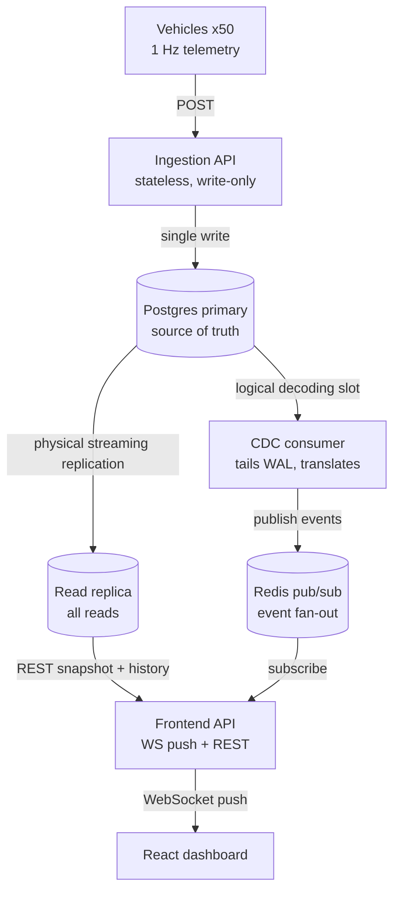

# ADR-0001: Fleet telemetry monitoring — system architecture

- **Date:** 2026-06-16
- **Deciders:** Joctã Torres
- **Tags:** architecture, postgres, cdc, concurrency, real-time

---

## Context and problem statement

We are building a monitoring service for a fleet of ~50 autonomous industrial vehicles. Each vehicle emits a telemetry event at 1 Hz containing `vehicle_id`, `timestamp`, `lat`/`lon`, `battery_pct`, `speed_mps`, `status` (`idle` | `moving` | `charging` | `fault`), `error_codes[]`, and `zone_entered` (a zone ID string, non-null only on the event where the vehicle crossed into a new zone).

The service must:

1. Ingest telemetry via a POST endpoint, absorbing bursts of concurrent writes from many vehicles.
2. Persist events to PostgreSQL.
3. Detect anomalies in real time.
4. Maintain a per-zone entry counter where **every** entry is counted, even when many vehicles enter the same zone in the same second (e.g. shift-change convergence on charging zones).
5. On a `fault` transition, atomically cancel the vehicle's active mission and create a maintenance record.
6. Serve recent anomalies filtered by vehicle and time range.
7. Serve the current aggregate fleet state (per-status counts) safely under concurrent updates.
8. Drive a React + TypeScript dashboard showing live status/battery, the latest anomaly per vehicle, and live per-zone counts.

### Constraints (fixed by stakeholders)

- **PostgreSQL is mandatory** as the database.
- DB **reads and writes must be decoupled** onto dedicated instances.
- The **ingestion API must be stateless** (horizontally scalable, no authoritative in-process state).
- The dashboard must receive **low-latency data over WebSocket**.
- There are **two separate APIs**: one for vehicle ingestion, one serving the near-real-time dashboard.

### The real engineering challenge

At 50 vehicles × 1 Hz, raw throughput (~50 writes/sec) is trivial for PostgreSQL. The difficulty is **correctness under concurrency** — lost-update-free counters, atomic multi-table fault handling, and a consistent fleet aggregate — plus delivering changes to the dashboard with low latency without coupling the write path to the read path.

---

## Decision drivers

- Correctness under concurrent writes (no lost increments, no partial fault transitions).
- Clean separation of read load from write load.
- A stateless, independently scalable ingestion path.
- Low-latency (sub-second) propagation of changes to dashboards, without multiplying DB read load per connected client.
- Avoiding inconsistency between persisted state and the event stream that drives the UI.
- Operational simplicity proportional to the actual scale.

---

## Considered options — event propagation to the dashboard

The central fork was how committed changes reach the dashboard.

### Option A — Synchronous dual-write (DB commit, then publish to Redis in the request path)

The ingestion API commits to Postgres and then publishes a domain event to a broker.

- Pro: simplest mental model; one fewer moving part.
- Con: the DB commit and the publish are **not one transaction**. A crash between them either persists an event the dashboard never hears about, or publishes one that never committed. This is the classic dual-write inconsistency.

### Option B — Change Data Capture (CDC) from the Postgres WAL → Redis _(chosen)_

The ingestion API writes **only** to Postgres. A CDC consumer tails the primary's logical replication slot and publishes derived events to Redis; frontend API instances subscribe and fan out over WebSocket.

- Pro: the event stream is a **deterministic function of the committed WAL** — the dual-write inconsistency class is eliminated. Ingestion becomes a pure DB writer.
- Pro: transaction boundaries and ordering are preserved by logical decoding.
- Con: introduces a singleton CDC consumer and the operational discipline of monitoring replication-slot lag (unbounded WAL retention if the consumer stalls).

### Option C — Postgres `LISTEN`/`NOTIFY`

The writer issues `NOTIFY`; the frontend API `LISTEN`s.

- Pro: no extra infrastructure beyond Postgres.
- Con: notifications fire on the issuing node, pinning the real-time path to the primary and undercutting the read/write split; 8 KB payload limit; at-least-once/durability semantics are weaker.

### Option D — Poll the read replica on a timer

- Con: replication lag **plus** poll interval, and read-replica load scales with (clients × frequency). Rejected for a near-real-time dashboard.

---

## Decision outcome

**Chosen: Option B (CDC-based propagation), within a primary/replica split and a Redis fan-out layer.**

The architecture is:



The primary's write-ahead log is tapped **twice** by independent mechanisms: physical streaming replication feeds the read replica (serving REST queries), and logical decoding feeds the CDC consumer (deriving the event stream). The ingestion API never touches Redis.

---

## Detailed decisions

### D1 — Read/write separation

Writes go to a single Postgres primary; reads (fleet aggregate, anomaly history) are served from a streaming read replica. This isolates analytical/read load from the write path. REST reads tolerate the replica's millisecond-scale replication lag; the dashboard's true real-time path does not depend on the replica (see D5).

### D2 — Stateless ingestion API, stateful frontend API

The ingestion API is stateless by nature: validate → write → return, with no session or in-process authoritative aggregates, so it scales horizontally behind a load balancer. The frontend API is intentionally **stateful** — it holds WebSocket connections — but holds no authoritative state: on connect it sends a snapshot (one replica query) and then streams deltas from Redis, so any instance can serve any client and instances can be added or replaced freely.

### D3 — CDC over dual-write

As above. Consequences specific to CDC:

- **Anomaly detection stays synchronous** inside the ingestion API, in the same transaction as the telemetry write. CDC does not make detection asynchronous — it merely observes the resulting rows. The `anomalies` INSERT *is* the event.
- **The consumer is a trivial translator:** three watched tables map to three event types (`vehicle_state_changed`, `anomaly_detected`, `zone_count_changed`).
- **Redis is retained** as the fan-out layer. A logical slot is a single-reader construct, so exactly one CDC consumer reads the slot and publishes to Redis; N frontend instances subscribe. This is what lets the frontend API scale horizontally.

### D4 — Redis as the fan-out broker

Redis pub/sub decouples the (singleton) CDC consumer from the (horizontally scaled) frontend API and lets one log-derived event reach N dashboards at ~0 additional DB cost.

### D5 — WebSocket over polling

The dashboard receives pushes over WebSocket. A push model gives sub-second latency and, critically, costs ~0 extra DB load per client because updates originate once from the CDC stream and fan out through Redis. Polling the replica would multiply read load by (clients × frequency) and stack replication lag on top of the poll interval. On connect, the client receives a one-shot REST snapshot from the replica, then consumes the live WebSocket delta stream.

### D6 — Concurrency control

**Zone-traversal counter.** Increment with a single server-side statement:

```sql
UPDATE zone_counts SET entry_count = entry_count + 1 WHERE zone_id = $1;
```

The read-modify-write executes inside Postgres under a row-level lock, so concurrent increments to the same zone serialize and none are lost. An application-level read-then-write (`SELECT count` → `count + 1` → `UPDATE`) is **rejected** because two processes read the same value and one increment vanishes. At this scale a single counter row is sufficient; if an audit trail or zero hot-row contention is later required, switch to append-only `INSERT INTO zone_entries(...)` with counts derived by aggregation/rollup.

**`fault` transition (mission cancel + maintenance record).** Run as one transaction with a pessimistic lock on the vehicle row:

```sql
BEGIN;
SELECT 1 FROM vehicles WHERE vehicle_id = $1 FOR UPDATE;
UPDATE missions SET status = 'cancelled'
  WHERE vehicle_id = $1 AND status = 'active';
INSERT INTO maintenance_records (...) -- idempotent: guarded by transition + unique constraint
UPDATE vehicles SET status = 'fault' WHERE vehicle_id = $1;
COMMIT;
```

Locking the vehicle row serializes all fault handling for that vehicle, so concurrent fault events cannot double-cancel a mission or create duplicate maintenance records. `SELECT ... FOR UPDATE` is preferred over `SERIALIZABLE`: it is scoped to a single aggregate (the vehicle), avoids serialization-failure retry loops, and is exact. Idempotency (a transition guard plus a uniqueness constraint tied to the mission) protects against at-least-once delivery.

**Aggregate fleet state.** Maintain a `vehicle_current_state` table, one row per vehicle, upserted on every event:

```sql
INSERT INTO vehicle_current_state (...) VALUES (...)
ON CONFLICT (vehicle_id) DO UPDATE SET ...;
```

The aggregate is then `SELECT status, COUNT(*) FROM vehicle_current_state GROUP BY status` — 50 rows, internally consistent via MVCC, with no materialized counter to race on. This same table supplies the "previous reading" used by stateful anomaly checks at the cost of one indexed lookup.

### D7 — Anomaly definition

- **Stateless** (single event, checked on ingest): `status = fault` or non-empty `error_codes`; `battery_pct` below a critical threshold while `status != charging`; `speed_mps` above a fleet maximum.
- **Stateful** (needs the previous persisted reading): "stuck" (`status = moving` but `speed ≈ 0` for N consecutive seconds); "teleport" (position delta implies an impossible speed); battery rising while not charging.
- **By absence** (background watchdog): no event from a vehicle for > N seconds = comms loss.

Detected anomalies are written to an `anomalies` table (so the "recent anomalies by vehicle + time range" query is a plain indexed read on the replica) and surfaced live via CDC. _Specific thresholds are an open item (see below)._

---

## Consequences

### Positive

- No dual-write inconsistency: the event stream cannot diverge from committed state.
- A pure, stateless ingestion path; both APIs scale horizontally.
- Read load is isolated from the write path.
- Concurrency correctness is enforced at the database layer (row locks, atomic increments, MVCC snapshots) rather than in application code.
- Dashboards scale without adding DB read load.

### Negative / costs

- More moving parts: a read replica, Redis, and a CDC consumer in addition to the primary.
- The CDC consumer is a **singleton active reader** of the logical slot; high availability requires a standby that can resume the slot.
- **Replication-slot footgun:** if the consumer lags or dies, the primary retains WAL to preserve the slot position and disk can fill. Requires monitoring and retention caps.
- Small added event latency (WAL decode after commit, typically single-digit milliseconds).
- REST reads from the replica may trail the primary by milliseconds; acceptable because the real-time path uses WebSocket, not replica reads.

### Risks and mitigations

| Risk | Mitigation |
|---|---|
| Logical slot lag fills primary disk | Monitor slot lag; set `max_slot_wal_keep_size`; alert on retention growth. |
| CDC consumer outage stalls live updates | Run a hot standby; LSN bookmarking lets it resume; dashboards re-snapshot from the replica on reconnect. |
| Replica lag shows stale REST snapshots | Treat WebSocket as the source of liveness; snapshot is best-effort initial state only. |
| Burst of concurrent zone entries | Atomic `x = x + 1` (or append-only inserts) guarantees no lost counts. |

---

